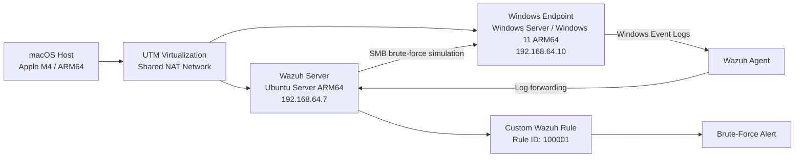
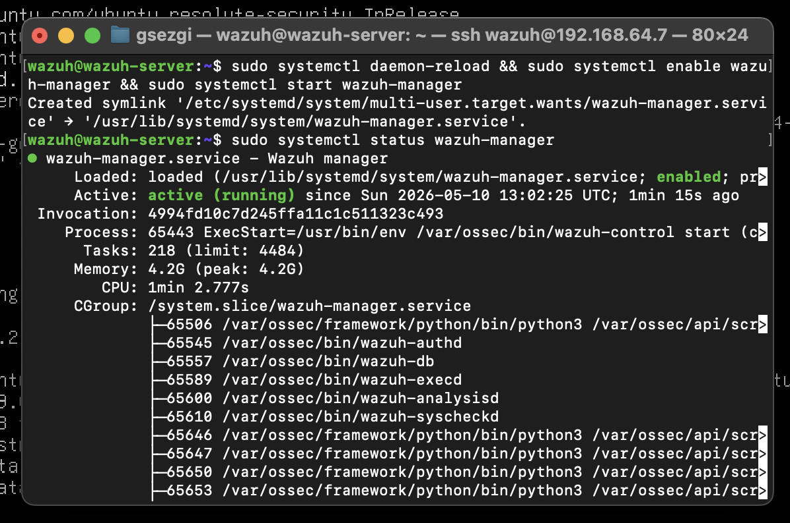
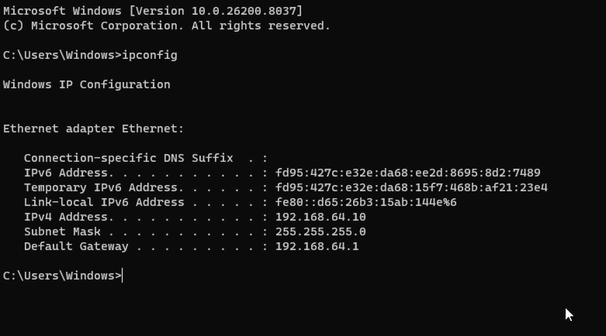
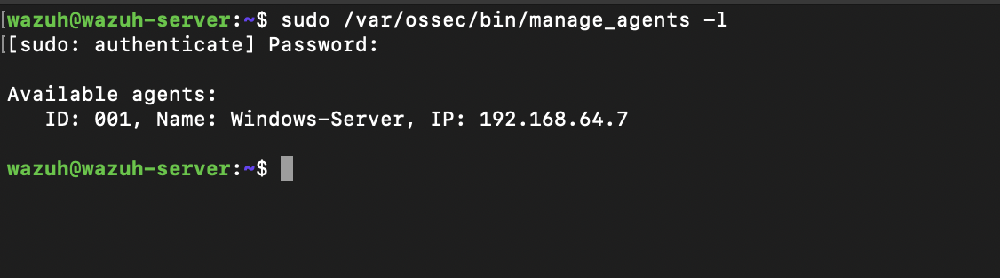
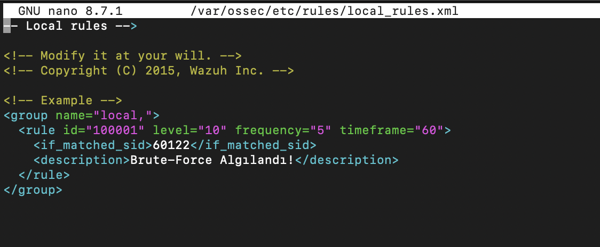
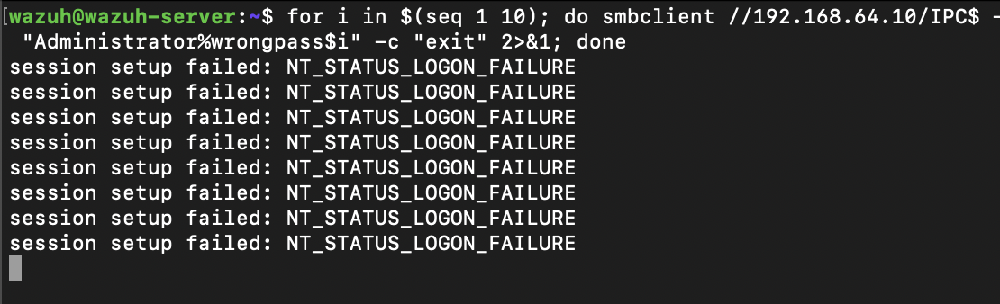
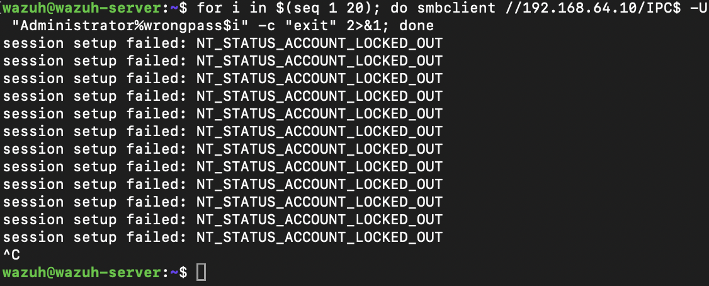
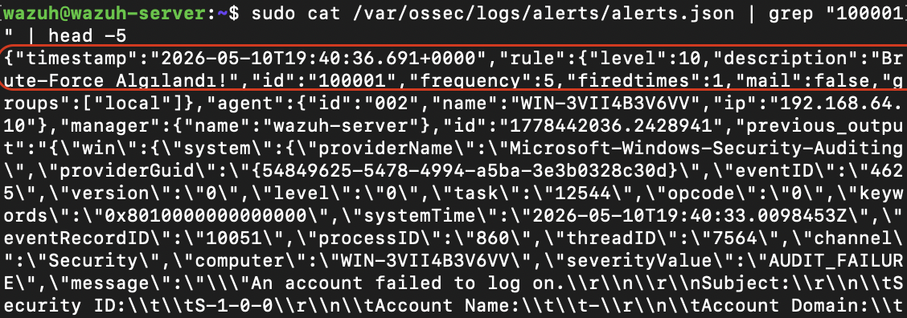

# Windows Server Brute-Force Detection with Wazuh SIEM

**Author:** Görkem Sezgi Yılmaz  
**Date:** May 11, 2026  
**Project Type:** Personal Blue Team Lab / SIEM Monitoring  
**Focus:** Log ingestion, custom rule correlation, Windows authentication monitoring, and brute-force detection

## Overview

This project demonstrates how to build a small SIEM lab environment with **Wazuh** and use it to detect brute-force login attempts against a Windows endpoint.

The lab was designed to simulate a realistic security monitoring workflow: deploying a Wazuh Manager, connecting a Windows endpoint through the Wazuh Agent, enabling Windows authentication logging, creating a custom correlation rule, launching a controlled SMB brute-force simulation, and validating the resulting alerts.

The main goal was to understand how endpoint logs can be collected, correlated, and converted into actionable security alerts in a SIEM environment.

## Lab Architecture



## Environment

| Component | Details |
|---|---|
| Host OS | macOS on Apple M4 ARM64 |
| Virtualization Platform | UTM, QEMU-based |
| Network Mode | UTM Shared Network, NAT |
| Wazuh Server OS | Ubuntu Server 26.04 LTS, aarch64 |
| Wazuh Version | Wazuh Manager v4.14.5 |
| Windows Endpoint | Windows Server / Windows 11 ARM64 |
| Wazuh Server IP | `192.168.64.7` |
| Windows Endpoint IP | `192.168.64.10` |
| Attack Simulation Tool | `smbclient` |
| Target Protocol | SMB |

## Objectives

- Deploy a working Wazuh SIEM environment in a local virtual lab.
- Install and configure Wazuh Manager on an ARM64 Ubuntu Server VM.
- Install and register a Wazuh Agent on a Windows endpoint.
- Enable Windows auditing for failed logon events.
- Create a custom Wazuh correlation rule for brute-force detection.
- Simulate repeated SMB authentication failures in a controlled environment.
- Validate the generated alerts through Wazuh log files.

## 1. Wazuh Server Setup

The Wazuh Server was installed on an Ubuntu Server virtual machine running on UTM. The VM was configured with:

- **6 GB RAM**
- **2 vCPUs**
- **50 GB disk space**
- **Shared Network NAT mode**

Because the host machine used an **Apple M4 ARM64 architecture**, the installation process required additional manual work. Wazuh's default automated installation script was not suitable for this architecture, so the Wazuh repositories and packages were configured manually.

After installation, SSH access was enabled to make terminal interaction easier from macOS. The Wazuh Server received the IP address:

```text
192.168.64.7
```

## 2. Wazuh Manager Installation and Configuration

During the setup process, several compatibility issues were caused by the ARM64 environment. The standard Wazuh automated installer primarily targets x86_64 systems, so the installation had to be completed manually through the package manager.

The following tasks were completed:

- Added Wazuh repositories manually.
- Installed the Wazuh Manager package through APT.
- Verified Wazuh services using `systemctl` and Wazuh control utilities.
- Checked that the manager was ready to accept agent connections.
- Resolved disk allocation issues by extending the LVM volume.

The disk expansion was completed with:

```bash
sudo lvextend -l +100%FREE /dev/mapper/ubuntu--vg-ubuntu--lv
sudo resize2fs /dev/mapper/ubuntu--vg-ubuntu--lv
```

After the configuration was completed, the Wazuh Manager services were confirmed to be running successfully.



*Wazuh Manager service status after the manual installation and configuration process.*

## 3. Windows Endpoint Setup

A second virtual machine was created for the Windows endpoint. The VM was configured with:

- **4 GB RAM**
- **4 CPU cores**
- **64 GB disk space**

During the installation, the VM initially booted into the UEFI Shell instead of the installer. This was resolved by manually launching the `BOOTAA64.EFI` file.

After installation, the endpoint received the following IP address:

```text
192.168.64.10
```



*Windows endpoint network configuration confirming the lab IP address.*

To support remote access and attack simulation, the following services and configurations were enabled:

- RDP service
- SMB service
- Firewall permissions for RDP and SMB
- Windows failed logon auditing through `auditpol`

Failed logon auditing was required so that Windows authentication failures could be captured and forwarded to Wazuh.

## 4. Wazuh Agent Installation and Registration

The Wazuh Agent was downloaded from the official Wazuh package source and installed on the Windows endpoint.

During the installation, the Wazuh Manager IP address was configured as:

```text
192.168.64.7
```

The agent registration process was completed with the Wazuh `manage_agents` utility:

1. A new agent named `Windows-Server` was created on the Wazuh Manager.
2. An authentication key was generated for the agent.
3. The key was imported on the Windows endpoint using `manage_agents.exe`.
4. The Wazuh Agent service was restarted.
5. The agent connection was verified from the Wazuh Manager CLI.

The registered agent appeared as:

```text
ID: 001
Name: Windows-Server
IP Address: 192.168.64.7
```



*Registered Windows agent listed from the Wazuh Manager CLI.*

## 5. Custom Correlation Rule

A custom Wazuh rule was created in:

```text
/var/ossec/etc/rules/local_rules.xml
```

The goal of the rule was to detect repeated Windows logon failures within a short time window.

The custom rule was assigned **Rule ID `100001`** and configured to trigger when **five or more failed logon events** were detected within **60 seconds**.

```xml
<group name="local,">
  <rule id="100001" level="10" frequency="5" timeframe="60">
    <if_matched_sid>60122</if_matched_sid>
    <description>SMB brute-force activity detected</description>
  </rule>
</group>
```



*Custom local Wazuh rule configured to detect repeated failed logon events.*

### Rule Logic

| Field | Value | Purpose |
|---|---:|---|
| id | 100001 | Custom local rule ID |
| level | 10 | Alert severity level |
| frequency | 5 | Number of matched events required |
| timeframe | 60 | Time window in seconds |
| if_matched_sid | 60122 | References Wazuh's built-in Windows logon failure rule |

After saving the rule, the Wazuh Manager service was restarted so the new rule could become active.

## 6. Brute-Force Simulation

The attack scenario was simulated from the Wazuh Server against the Windows endpoint over SMB.

> This test was performed only inside an isolated and authorized lab environment.

The following loop was used to generate repeated failed authentication attempts:

```bash
for i in $(seq 1 10); do
  smbclient //192.168.64.10/IPC$ -U "Administrator%wrongpass$i" -c "exit"
done
```

Each attempt used an incorrect password for the Administrator account. As expected, the Windows endpoint returned failed logon responses:

```text
NT_STATUS_LOGON_FAILURE
```



*Repeated SMB authentication failures generated during the controlled lab simulation.*

After multiple failed attempts, the Windows Account Lockout Policy was triggered and the account became locked:

```text
NT_STATUS_ACCOUNT_LOCKED_OUT
```



*Account lockout response after repeated failed authentication attempts.*

This confirmed that the brute-force scenario had been successfully simulated.

## 7. Alert Validation

After the simulation, the Wazuh alert log was inspected on the Wazuh Manager:

```text
/var/ossec/logs/alerts/alerts.json
```

The generated alerts confirmed that the failed logon events, account lockout event, and custom brute-force correlation rule were detected.



*Generated Wazuh alert showing the custom brute-force detection rule.*

### Detected Events

| Detection | Windows Event ID | Wazuh Rule ID | Level | Description |
|---|---:|---:|---:|---|
| Failed logon | 4625 | 60122 | 5 | Unknown user or bad password |
| Account lockout | 4740 | 60115 | 9 | User account locked out |
| Brute-force correlation | N/A | 100001 | 10 | Five or more failed logons within 60 seconds |

The custom alert included useful investigation fields such as:

- Source IP address: 192.168.64.7
- Target username: Administrator
- Detection timestamp
- Triggered Wazuh rule ID: 100001

## Key Challenges and Fixes

| Challenge | Resolution |
|---|---|
| ARM64 compatibility issues | Wazuh packages and repositories were configured manually. |
| Automated installer limitations | Manual installation was used instead of the default script. |
| Disk space issue | The LVM volume was extended and resized. |
| Windows VM booted into UEFI Shell | BOOTAA64.EFI was launched manually. |
| Missing authentication telemetry | Windows failed logon auditing was enabled with auditpol. |

## Results

The lab successfully demonstrated that Wazuh can detect brute-force activity against a Windows endpoint by correlating repeated failed logon events.

The final detection workflow worked as follows:

1. SMB authentication attempts were sent to the Windows endpoint.
2. Windows generated failed logon events.
3. The Wazuh Agent forwarded the logs to the Wazuh Manager.
4. Wazuh matched the failed logons with its built-in rule.
5. The custom correlation rule detected repeated failures within the configured time window.
6. A high-severity brute-force alert was generated.

## Skills Demonstrated

- SIEM deployment and configuration
- Wazuh Manager setup
- Wazuh Agent registration
- Windows Event Log monitoring
- Authentication failure analysis
- Custom Wazuh XML rule creation
- Log correlation and alert validation
- ARM64 troubleshooting on Apple Silicon
- Basic attack simulation in an isolated lab

## Disclaimer

This project was created for educational and defensive security purposes only. All testing was performed in a controlled local lab environment. The techniques shown here should only be used on systems that you own or are explicitly authorized to test.
